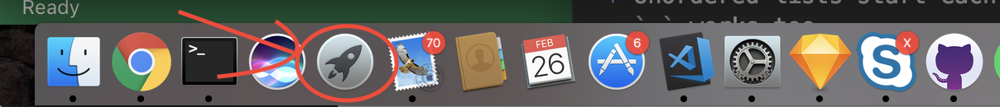
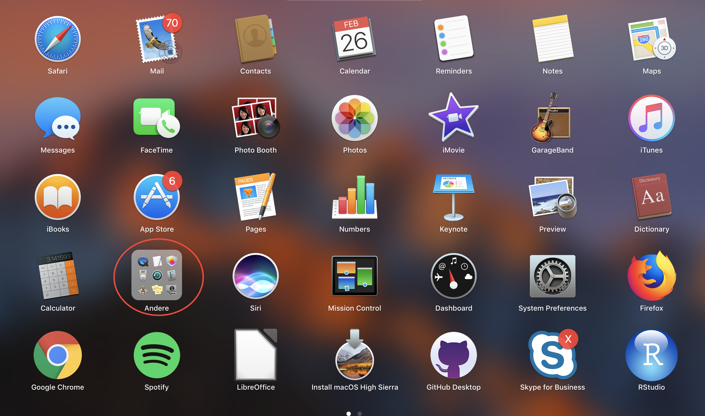
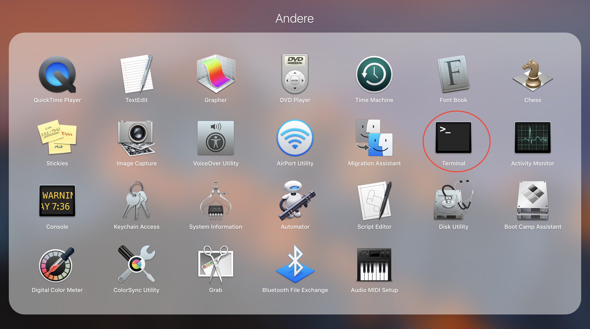
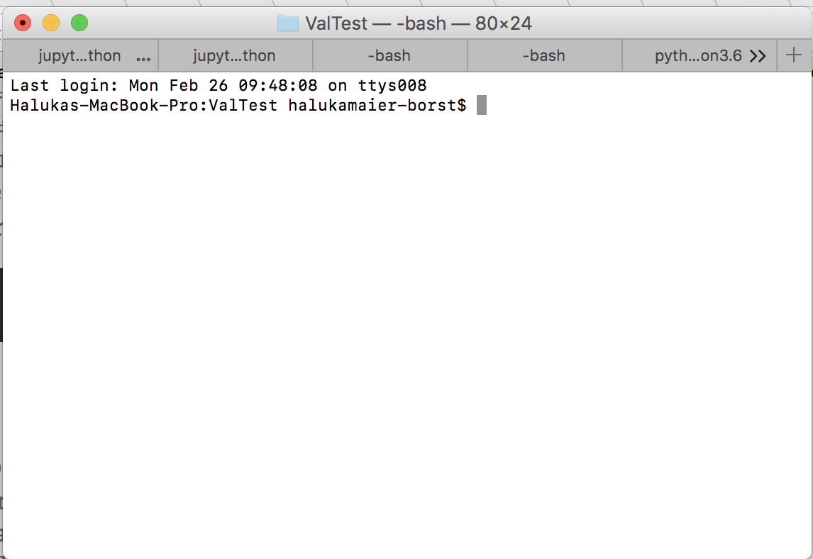
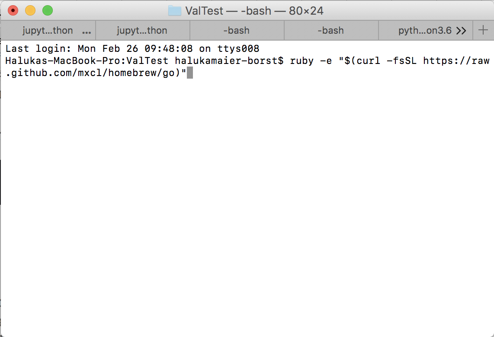
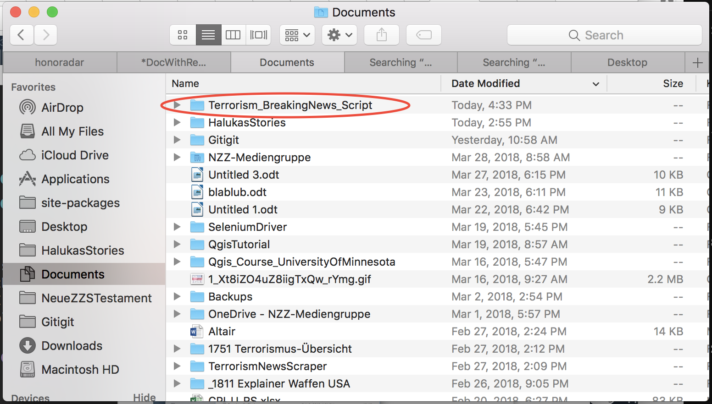
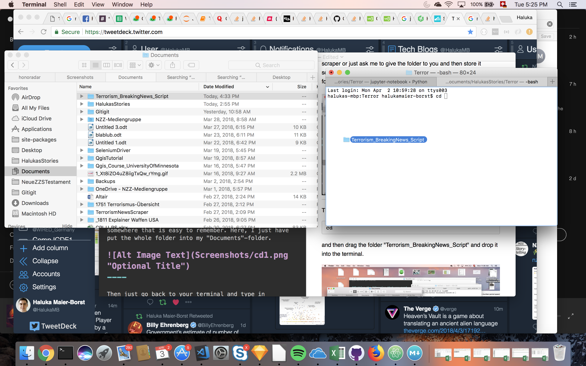
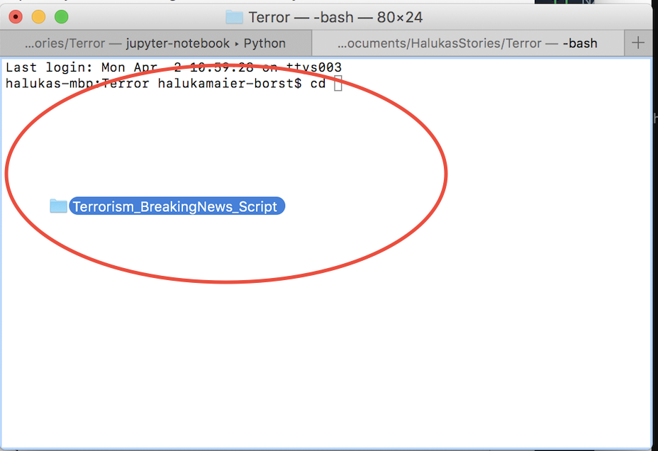
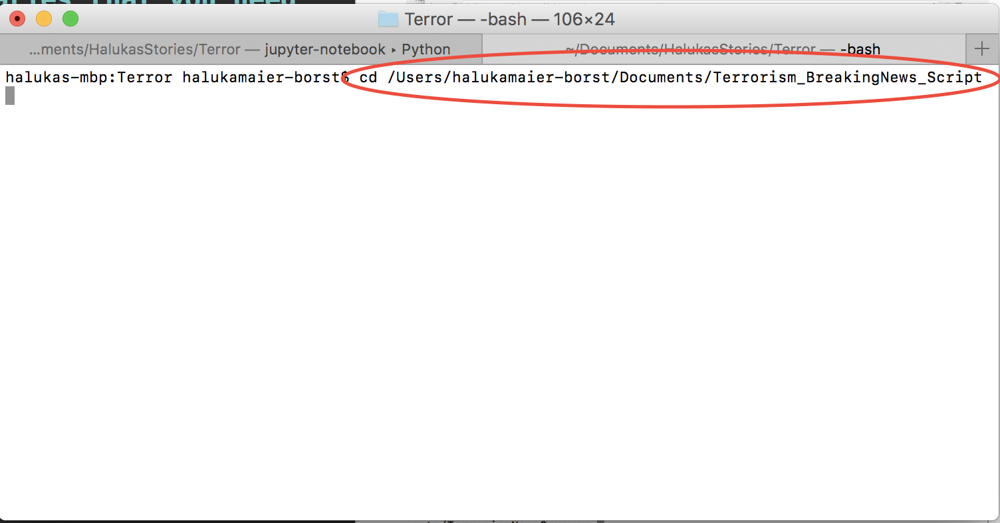

# Terrorism\_BreakingNews\_Script

This Readme.md should explain how to set up your Mac to run Jupyter Notebooks and then also how to run a simple python scraper from there.

##Setting up your python environment (only needed the first time)

First things first, let's make sure that you can quickly install everything you need. Go to your Launchpad.


----

Go to "other" / "Andere"


----
Click on Terminal

----

Then something like this should appear. This is the "terminal"

----
Now copy and paste the following code into your terminal

```
ruby -e "$(curl -fsSL https://raw.github.com/mxcl/homebrew/go)"
```

Like this:



And hit "enter"

...wait for brew finishing up its magic.

After this, we want to set up Python3


```
brew install python3
```

And then we want to install the awesome library tool pip3. First do...

```
curl -O http://python-distribute.org/distribute_setup.py
```
Then...

```
sudo python3 distribute_setup.py
```
Next...
```
curl -O https://raw.github.com/pypa/pip/master/contrib/get-pip.py```

And finally.

```
sudo python3 get-pip.py
```

##Getting the libraries that you need for this scraper (also only needed the first time)
Now download the folder "Terrorism\_BreakingNews\_Script" with the scraper or just ask me to give the folder to you and then store it somewhere that is easy to remember. Here, I just have put the whole folder into my "Documents"-folder.


----

Then just go back to your terminal and type in

```
cd 
```
and then drag the folder "Terrorism\_BreakingNews\_Script" and drop it into the terminal.



like this



and then this should pop up



Hit enter. Now you are in the folder. Install the libaries that you will need by typing into the terminal.

```
pip3 install -r requirements.txt
```
Once it is done with all the installation processes, you are good to go.

##The actual scarping/analysing (always needed)

Launch the terminal as explained earlier and then type in cd and get into the folder again by drag and dropping the folder into the terminal.

###Recap from earlier:

```
cd 
```
and then drag the folder "Terrorism\_BreakingNews\_Script" and drop it into the terminal.


like this


and then this should pop up


Hit enter. Now you are in the folder. 

----

###Now the actual analysis

Type in

```
jupyter notebook
```

like this...


And on your Chrome Browser a new window should open. Looking like this.


Click on "Terrorism\_Master_Script.ipynb" and something like this should appear


This is the Jupyter Notebook that does the job. Just follow the instructions and execute the script from top to bottom. To execute the blue-highlighted box of code just hit:

```
Enter + Shift
```

To change code, just double-click on each code-box.
