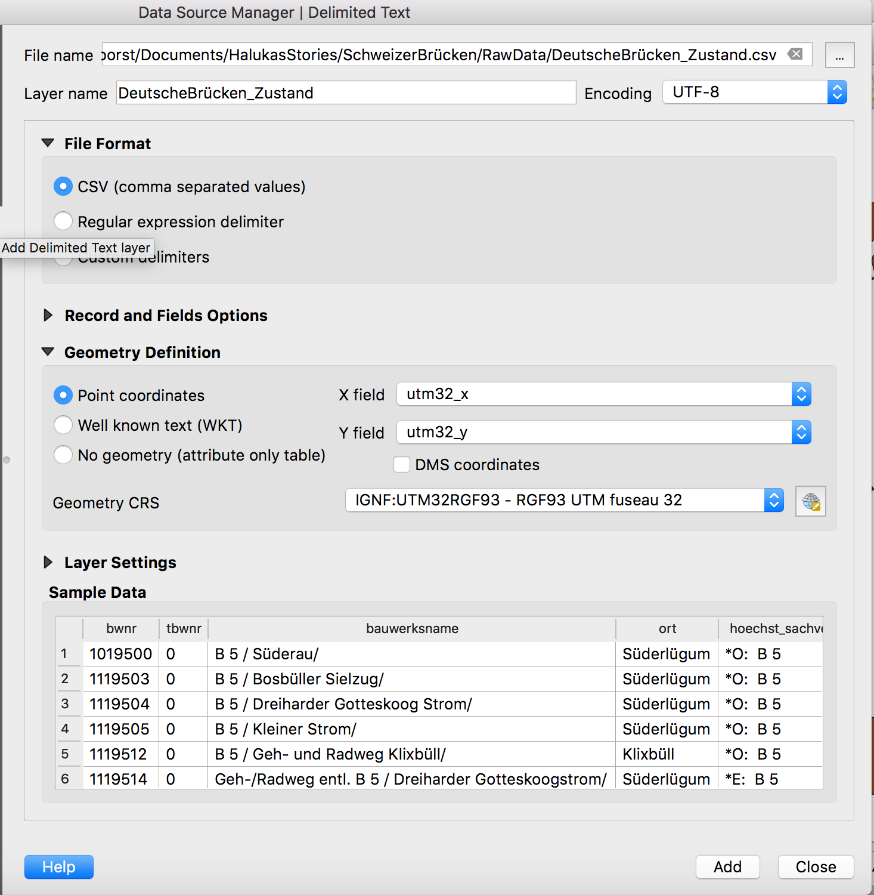
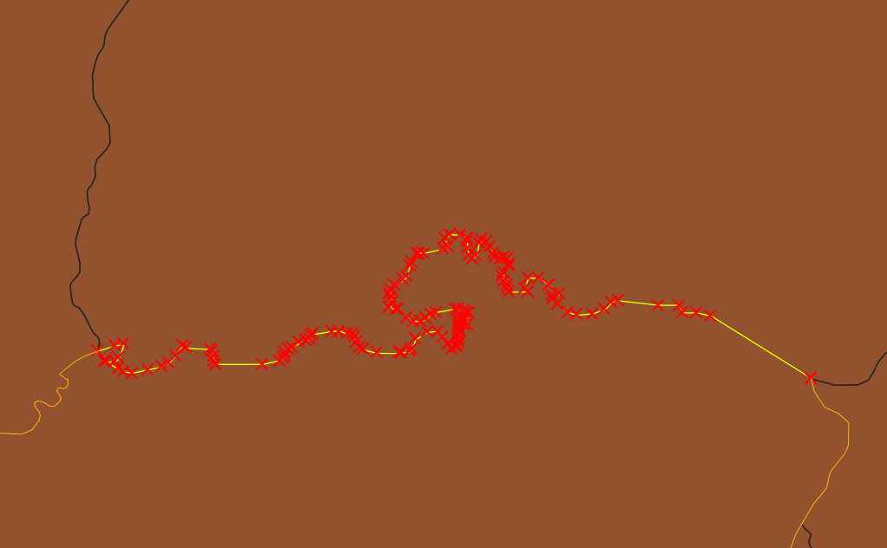
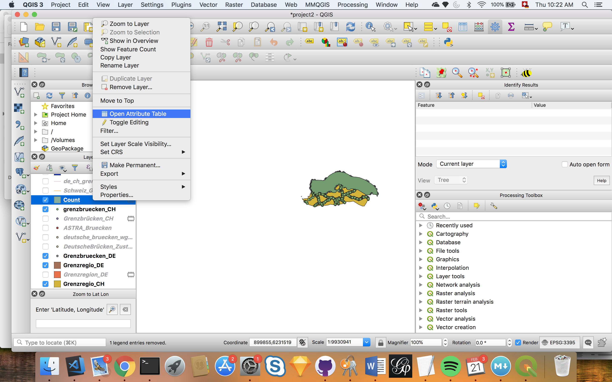
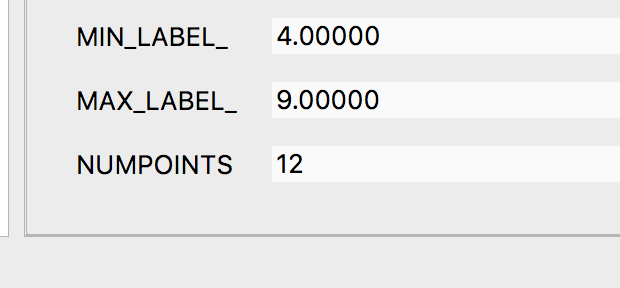
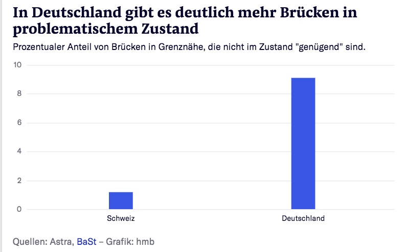

# "Crossborder investigation"

## How to deal with different projections in one map and do geo-calculations ... Or how we found out how Swiss bridges compare to German bridges.

## Preface to the preface
This is an exception of how normally READMEs are structured on this repo. This is an example of a story that we decided to not run with based on the data and the methods we present here. The reasons were that our readership is still mostly Swiss and also that a number of editors said that the results were neither alarming nor surprising. But we thought that the results and especially the methods might be helpful to others. Also, it could be a chance for us to learn more from mapping experts, if they can find problems in the described methods.

## Preface: So, how did all this start?

We got the hint that a lot of German bridges close to the Swiss-German border are in a bad condition.

Hint:

[With a link to:](https://community.wolfram.com/groups/-/m/t/1407711?wal_campaign=%7B%22campaign%22%3A%22insider4346_a_wv1%22%2C%22keyword%22%3A%22Insider2018Q4A%22%2C%22userEmail%22%3A%22792827%22%7D)

We then took the data from [the official German authority for roads and bridges](https://www.bast.de/BASt_2017/DE/Statistik/statistik-node.html) and also, we got from Swiss Astra the data for Swiss bridges. 

Then we wanted to bring the bridges all on a map in Qgis. 

## Part 1) Mapping two CSVs with different projections
### First set the project CRS (Coordinate Reference System)

### Then load shapes for countries from something like [naturalearth](https://www.naturalearthdata.com/downloads/10m-cultural-vectors/10m-admin-0-countries/).

### Next, we load the dataset for Germany as a csv

### And set the layer CRS as UTM fuseau 32 and also tell QGIS what x and y coordinates are

### However, sometimes the loaded layer does not show up right away

### We can fix this by setting the CRS of the layer once more in the left menu

### Now, the points show up and we zoom to the points with "Zoom to Layer"

### Next, we do the exact same thing for the data for Switzerland. Import csv

### Set the CRS

### And then we should have both on the map.

##Step 2) Isolating the German-Swiss border

### Now we want to define the German-Swiss border. We unselect the layers with the bridges shown as dots and then select the polygon of Switzerland.

### And we save this single polygon as one particular layer. Note that the tickbox "save only selected features" is used.

### Next, we take this polygon and turn it into lines

### And zoom to the parts where the border begins and ends.

### We then select this lines of the polygon and select the split_features option

### We draw a red line across the border where it changes from German-Swiss to French-Swiss. First we click left at one end and then click left at the other of the border. By clicking right, we save this split.

### We do the exact same thing once more at the other end of the German-Swiss border.

### Sometimes this ends up in having this particular feature being split in two border parts. We can merge them by select features and clicking right on both of them one after another.

### Then we should have selected the whole border.

### And we can save it as the German-Swiss border here.

### So that we have one feature only consisting of the border.

## Step 3) Creating the border region and count how many bridges are in there and how many of them are in a bad state

### We turn the isolated border into a file with the right projection.

### Then we create a buffer around this border of 50 kilometres which is 50 000 metres.

### As you can see, we have some weird artefacts due to certain parts of the border creating overlapping buffers. We fix this by dissolving.

### In case the new buffer is hiding the original border, just drag the layer with the border above the dissolved buffer.

### Next we want to adjust this rather oddly shaped blob so that it dpes not overlap into France, Liechtenstein and the Lake Constance.

### For this, we have to isolate the shape of Germany in the same way we did it for Switzerland. Select the shape of Germany and save it in the projection that we use for the whole project.

### Next, we use the tool intersection and let QGIS get the overlap between our buffer and the shape of Switzerland 

### Then we do the same thing for Germany. If there are any problems, as a rule of thumb, it might be because the shapes are in different projections. If so, then export the layers and save them in the right projection. 

### Now, we have the border regions for both countries.

### The next step is to filter the bridges that we have for all of Switzerland and Germany down to the ones in this buffer. 

### Again, we use the "Intersection" tool and this time, we look for the overlap of points and polygons.
### This is how we did it for Switzerland

### And this is what it looks like for Germany

### Again, if there are problems with this step, most likely it is due to different projections of layers. In this case, save the layers in the same projection and then redo this step.
### Next, we want to figure out how many points/bridges are in these polygons overall. We do this with the tool "Count Points in Polygon" and first for Germany.

### This creates a new layer which has an attribute with the name NUMPOINTS that gives the number of bridges in the border region. For Germany, we end up with 1205.

### Then we do the exact same thing for Switzerland. Here, we end up with 994.

### Lastly, we want to know how many of these bridges are in a bad state. We duplicate the layer with the briges in the border region for Switzerland and then use the "Filter" option.

### Then we build a query by defining that we only want bridges with a rating of 4 or worse. This is the definition of bridges that Swiss authorities define as "bad" or "alarming".

### And we do the same for German bridges in the polygons. With the difference that we define 3 or worse as the benchmark, as the German rating system works slightly different.

### We should now have now two layers with points that are rated as "bad" or "alarming". 

### Again, we let QGIS count these points in the polygons.

### And check for both count layers the table.

### Which brings us to our final result. We have 12 problematic bridges in Switzerland. Out of 994.

### And 110 in Germany. Out of 1205.

### As a graphic

